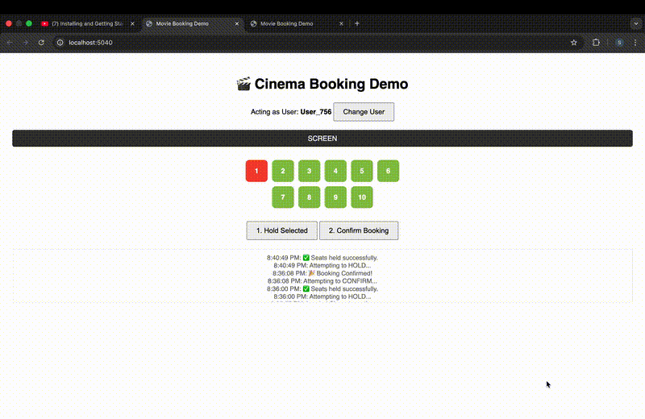

# Movie Booking Engine

A robust, concurrency-safe backend system for managing movie seat availability and bookings.
Designed to handle high contention, network failures, and race conditions without overbooking.





## The Problem
We need to ensure that when 1,000 users try to book the last seat for "Avengers" at the exact same millisecond:
1. Only **one** user succeeds.
2. The other 999 are told the seat is taken.
3. If the winner's connection drops before payment, the seat eventually becomes free again.
4. The system state remains consistent even if the server crashes mid-transaction.

## System Design & Architecture

### Tech Stack
- **Languages**: C# (.NET 8)
- **Database**: PostgreSQL (Relational)
- **ORM**: Entity Framework Core

### Component Overview
1.  **API Layer**: Stateless REST API (`BookingService`) handles requests.
2.  **Database Layer**: PostgreSQL serves as the **Single Source of Truth** and the **Lock Manager**.
3.  **Background Worker**: `SeatCleanupWorker` handles state consistency for abandoned sessions.

---

## Seat Booking Workflow

1.  **Browse**: User views the screen. (GET `/availability`).
2.  **Select & Hold**: User selects a seat.
    - API sends `HOLD` request.
    - Database **Locks** the row.
    - If valid, seat status becomes `HELD` (Yellow).
    - If invalid (already held), request fails.
3.  **Confirm**: User completes the booking.
    - API sends `CONFIRM` request.
    - Seat status updates to `BOOKED` (Red).
    - `Booking` record is created.
4.  **Cleanup**: If User holds but doesn't confirm within 2 minutes:
    - The background worker releases the seat.
    - Seat becomes `AVAILABLE` (Green) again.

---

## Approach to Handling Concurrency

We intentionally avoid "application-level locks" (like Redis locks or in-memory mutexes) because they are fragile in distributed environments or across server restarts.

Instead, we rely on **Pessimistic Locking** (`SELECT FOR UPDATE`) in PostgreSQL.

**Why this approach?**
- **Consistency**: The database cannot be bypassed. No matter how many API instances run, the database lock queue ensures serial processing for a specific seat.
- **Simplicity**: No need for a separate Distributed Lock Manager (DLM).
- **Correctness**: Guarantees zero overselling (ACID transactions).

---

## Running the Project

**Prerequisites**: Docker (for Postgres) or a local Postgres instance, and .NET 8 SDK.

1. **Start Database**
   ```bash
   # If you have Docker
   docker run -e POSTGRES_PASSWORD=postgres -p 5432:5432 -d postgres
   ```
   *Or use your local Postgres connection string in `appsettings.json`.*

2. **Run Migrations**
   ```bash
   dotnet ef database update
   ```

3. **Start API**
   ```bash
   dotnet run
   ```
   The app seeds a demo show ("Inception") automatically on first run.

4. **Verify**
   - Check the **Swagger UI**: `http://localhost:5040/swagger`
   - Use the **included Frontend**: `http://localhost:5040/` (Simple HTML/JS visualization)

---

## Assumptions and Limitations

### Assumptions
- **Authentication**: Usage of "String User IDs" implies a guest or external auth system. We assume the client provides a unique identifier.
- **Seat Map**: We assume a fixed capacity per show (10 seats for demo, scalable to thousands).
- **Environment**: The database is reliable and supports row-level locking (Postgres/SQL Server).

### Limitations
- **Throughput**: Row-level locking serializes access to *contested* rows. This is perfect for accuracy but effectively queues users trying to buy the *exact same seat*.
- **Scalability**: For this specific assignment, we focused on correctness. A system generating millions of bookings per second might need an "Inventory Decrement" model instead of specific seat assignment at the locking phase.
